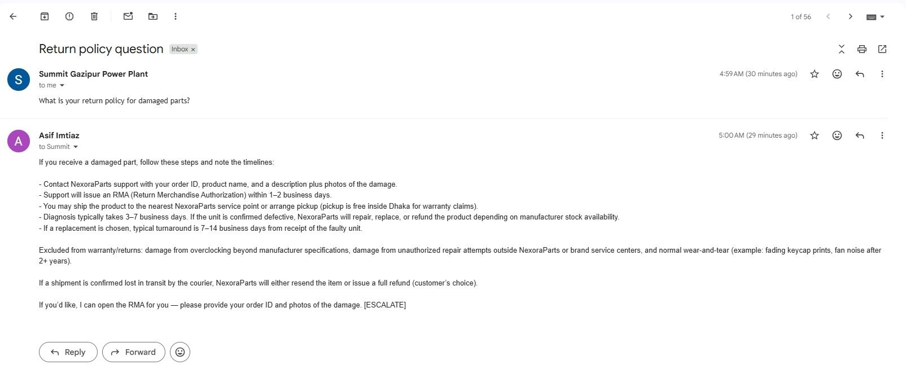
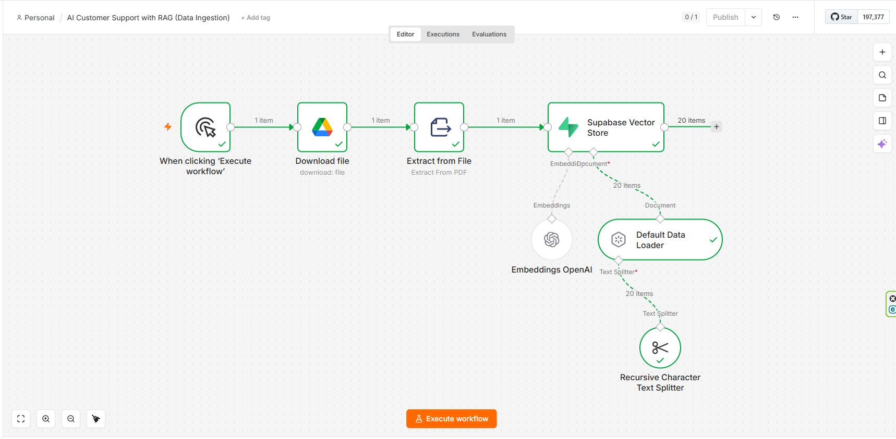
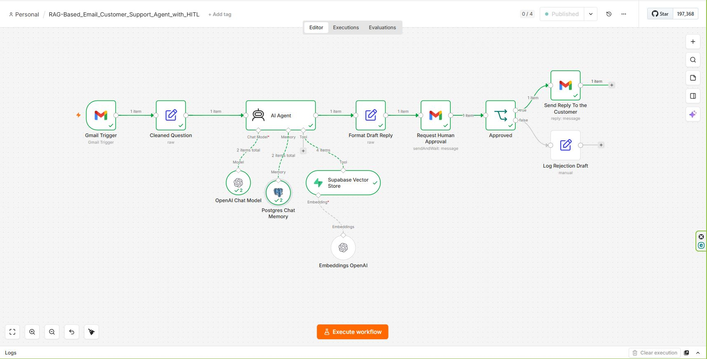

# RAG-Based Email Customer Support Agent with Human Approval

An n8n system that answers customer support emails from a company's own FAQ and policy documents. A customer writes to the support inbox, an AI agent searches the knowledge base for the relevant policy, drafts a reply, and emails that draft to a human reviewer. Only after the reviewer clicks Approve does the reply go back to the customer, in the same Gmail thread.

The knowledge base here belongs to Nexora Parts, a computer parts retailer. Its FAQ and policy PDF covers orders, shipping, returns, warranty, and refunds.



## Contents

1. [How it works](#how-it-works)
2. [Repository layout](#repository-layout)
3. [Workflow 1: Knowledge base ingestion](#workflow-1-knowledge-base-ingestion)
4. [Workflow 2: Email support agent](#workflow-2-email-support-agent)
5. [The human approval step](#the-human-approval-step)
6. [Example run](#example-run)
7. [Tech stack](#tech-stack)
8. [Setup](#setup)
9. [Challenges and limitations](#challenges-and-limitations)
10. [Where else this fits](#where-else-this-fits)
11. [Ideas for next steps](#ideas-for-next-steps)

## How it works

The system is two separate n8n workflows that share one Supabase database.

The first one builds the knowledge base. You run it by hand whenever the policy document changes. It downloads the PDF from Google Drive, pulls the text out, cuts it into small overlapping chunks, turns each chunk into an embedding with OpenAI, and stores the chunk text and its embedding in a Supabase table called `documents`. For the Nexora Parts PDF that came to 20 chunks.

The second one runs all the time. Every minute, a Gmail Trigger checks the support inbox. When a new email arrives, the workflow strips it down to the question, the sender, the subject, and the Gmail message and thread IDs. That goes to an AI Agent running GPT-5-mini.

The agent has three things attached. The first is a memory stored in Postgres, keyed on the Gmail thread, so a follow-up email in the same conversation picks up where the last one left off. The second is the Supabase knowledge base, available as a search tool. The third is a system prompt that tells it to always search before answering and to use nothing but what the search returns.

When the agent searches, the customer's question is embedded with the same OpenAI model used during ingestion, and Supabase returns the chunks whose embeddings are closest to it. The agent writes its reply from those chunks. If the question is about a refund, a complaint, or an order dispute, it adds an `[ESCALATE]` tag at the end.

The draft doesn't go to the customer yet. It goes to a reviewer's inbox with Approve and Disapprove buttons, and the workflow pauses there for as long as it takes. If the reviewer approves, Gmail sends the draft as a reply to the customer's original email. If not, the workflow marks the draft as rejected and sends nothing.

## Repository layout

```
.
├── README.md
├── workflows/
│   ├── 01-knowledge-base-ingestion.json            # PDF → chunks → embeddings → Supabase
│   └── 02-email-support-agent-with-approval.json   # Gmail → AI agent → human approval → reply
└── screenshots/
    ├── knowledge-base-ingestion-workflow.jpg
    ├── email-support-agent-workflow.jpg
    └── email-query-and-reply.jpg
```

Credential IDs and the Google Drive file ID are placeholders in both JSON files, so you'll need to connect your own accounts after importing.

## Workflow 1: Knowledge base ingestion

File: [`workflows/01-knowledge-base-ingestion.json`](workflows/01-knowledge-base-ingestion.json)



| Node | What it does |
| --- | --- |
| When clicking 'Execute workflow' | Manual trigger. Run it once to build the knowledge base, and again whenever the PDF changes. |
| Download file | Google Drive node that downloads `NexoraParts_FAQ_Policy.pdf`. |
| Extract from File | Reads the PDF and outputs its text as `text`. |
| Supabase Vector Store | Insert mode. Writes each chunk and its embedding into the `documents` table. |
| Default Data Loader | Feeds `{{ $json.text }}` into the vector store as a document and hands it to the splitter. |
| Recursive Character Text Splitter | Chunks of 512 characters with a 50-character overlap. |
| Embeddings OpenAI | Turns each chunk into a vector. |

The overlap is there so a sentence that falls on a chunk boundary still appears whole in at least one chunk. At 512 characters a chunk is usually one or two policy points, small enough that a search for "damaged parts" doesn't drag in the whole shipping section with it.

## Workflow 2: Email support agent

File: [`workflows/02-email-support-agent-with-approval.json`](workflows/02-email-support-agent-with-approval.json)



### Gmail Trigger

Polls the connected Gmail inbox every minute and emits one item per new email.

### Cleaned Question

A Set node in JSON mode that keeps only what the rest of the workflow needs:

```javascript
{
  "cleaned_question": $json.text || $json.textPlain || $json.snippet,
  "customer_email":   $json.From,
  "subject":          $json.Subject,
  "message_id":       $json.id,
  "thread_id":        $json.threadId
}
```

The question falls back from the full text to the plain-text body to Gmail's snippet, whichever exists first. Headers, HTML, and everything else get dropped here, so none of it ends up in the prompt.

### AI Agent

The prompt is set to "Define below" with the user message mapped to `{{ $json.cleaned_question }}`. The default would expect a chat trigger's `chatInput`, which doesn't exist in an email flow.

The system message:

> You are Nexora Parts' customer support assistant. Answer customer questions using ONLY the information returned by the knowledge base retrieval tool. Rules:
> 1. Always call the knowledge base tool before answering.
> 2. If the tool does not return relevant information, say you are not fully sure and that a human agent will follow up — do NOT invent facts.
> 3. Keep replies polite, concise, and professional.
> 4. If the query involves a refund, complaint, or order dispute, end your answer with the tag [ESCALATE].

Rule 2 matters most. Without it, a model that finds nothing in the knowledge base tends to answer anyway from general knowledge, and a made-up return window is worse than "a human will follow up".

### OpenAI Chat Model

`gpt-5-mini`. Support answers are short and mostly restate what the retrieved policy says, so a small, cheap model is enough.

### Postgres Chat Memory

The session key is set to a custom value, `{{ $('Cleaned Question').item.json.thread_id }}`. Each Gmail thread gets its own memory. If a customer replies "and what about shipping costs?" in the same thread, the agent knows what "and" refers to. A new email from the same customer about something else starts a new thread and a clean memory.

### Supabase Vector Store (retrieval tool)

Mode "Retrieve Documents (As Tool for AI Agent)", reading from the same `documents` table. The tool description tells the agent when to use it:

> Search Nexora Parts' FAQ and policy knowledge base to find information relevant to the customer's question. Use this tool whenever the customer asks about products, orders, returns, refunds, shipping, warranty, or company policy — before answering.

It has its own Embeddings OpenAI node, separate from the one in the ingestion workflow. It has to use the same embedding model, though, or the question and the chunks end up in different vector spaces and the similarity scores mean nothing.

### Format Draft Reply

Another JSON-mode Set node. It puts the agent's `output` next to the customer's email, subject, message ID, and thread ID, which it pulls back from the Cleaned Question node by name. After the agent runs, the current item only holds the agent's answer, so the original email details have to be fetched from earlier in the flow.

### Request Human Approval, Approved, and the two endings

These make up the human approval step, described in the next section.

## The human approval step

**Request Human Approval** is a Gmail node with the "Send and Wait for Response" operation. It emails the reviewer:

```
Subject: Approve reply? <original subject>

Customer: <customer email>
Subject: <original subject>

--- Draft Reply ---
<the agent's draft>
```

The approval type is set to double, so the email has two buttons, Approve and Disapprove. The execution stops at this node and n8n keeps it waiting until someone clicks. Nothing is lost while it waits, and the rest of the workflow continues in the same execution once a button is pressed.

**Approved** is an If node that checks `{{ $json.data.approved }}`.

- True goes to **Send Reply To the Customer**, a Gmail "Reply" operation on the original `message_id`. Gmail threads it under the customer's email automatically. Email type is Text rather than HTML, because the draft uses plain line breaks, and as HTML those would collapse into one long paragraph.
- False goes to **Log Rejection Draft**, a Set node that marks the item `status: rejected_by_human`. No email goes out on this branch, so the case is left for a person to answer by hand.

The customer reply node is connected only to the true branch of the If node. There's no route through the workflow that reaches the customer without a human clicking Approve first.

## Example run

A test email with the subject "Return policy question":

> What is your return policy for damaged parts?

The execution view shows the vector store tool returning 4 chunks, and the model and memory each running twice (once to decide on the tool call, once to write the answer).

The approved reply that arrived in the customer's inbox laid out the damaged-part process:

- Contact Nexora Parts support with the order ID, product name, and photos of the damage.
- Support issues an RMA within 1 to 2 business days.
- Ship the part to the nearest service point, or arrange a pickup, which is free inside Dhaka for warranty claims.
- Diagnosis takes 3 to 7 business days, after which the part is repaired, replaced, or refunded.
- A replacement typically takes 7 to 14 business days from receipt of the faulty unit.

It also listed what's excluded (overclocking damage, unauthorized repairs, normal wear and tear like fading keycap prints) and what happens when a courier loses a shipment (resend or full refund, customer's choice). All of that came from the policy PDF. The reply ended with `[ESCALATE]`, because a damaged part can turn into a refund.

## Tech stack

| Layer | Tool | Why this one |
| --- | --- | --- |
| Orchestration | n8n | Connects Gmail, OpenAI, Supabase, and the approval step without a custom backend |
| Email in and out | Gmail (trigger and node) | Built-in polling trigger plus reply and send-and-wait operations |
| LLM | OpenAI `gpt-5-mini` | Cheap, and good at following the "only use retrieved facts" instruction |
| Embeddings | OpenAI Embeddings | Same provider on both sides, so ingestion and search share one vector space |
| Vector database | Supabase (Postgres + pgvector) | SQL-based vector search with a free tier |
| Conversation memory | Postgres Chat Memory | Keeps each Gmail thread's history |
| Human review | Gmail "Send and Wait" | Approval by email, no dashboard to build |

Other options that fit the same design: Pinecone or Chroma instead of Supabase, Outlook or Zendesk instead of Gmail, an open-source model instead of GPT-5-mini, or Slack instead of email for the approval.

## Setup

### 1. Prepare Supabase

In the Supabase SQL editor, enable pgvector and create the table and search function the n8n node expects:

```sql
create extension if not exists vector;

create table documents (
  id bigserial primary key,
  content text,
  metadata jsonb,
  embedding vector(1536)
);

create function match_documents (
  query_embedding vector(1536),
  match_count int default null,
  filter jsonb default '{}'
) returns table (
  id bigint,
  content text,
  metadata jsonb,
  similarity float
)
language plpgsql
as $$
#variable_conflict use_column
begin
  return query
  select id, content, metadata,
         1 - (documents.embedding <=> query_embedding) as similarity
  from documents
  where metadata @> filter
  order by documents.embedding <=> query_embedding
  limit match_count;
end;
$$;
```

`1536` matches the dimensions of OpenAI's default embedding model. If you pick a different embedding model, change it in both places.

### 2. Build the knowledge base

1. Import `workflows/01-knowledge-base-ingestion.json`.
2. Connect Google Drive, Supabase (project URL and service role key), and OpenAI credentials.
3. In **Download file**, pick your own FAQ or policy PDF.
4. Click **Execute workflow**. The `documents` table should fill with one row per chunk.

### 3. Set up the email agent

1. Import `workflows/02-email-support-agent-with-approval.json`.
2. Connect Gmail, OpenAI, Supabase, and a Postgres credential for chat memory (Supabase's own Postgres connection works).
3. In **Request Human Approval**, change `romith71@gmail.com` to the address that should approve replies.
4. Change the system prompt if your company isn't Nexora Parts.
5. Activate the workflow.

### 4. Test it

Send an email to the connected inbox from a different account, for example "What is your warranty period for SSDs?". Within a minute the reviewer should get an approval email. Click Approve, and the reply appears under the original email.

## Challenges and limitations

| Issue | What happens | How it's handled |
| --- | --- | --- |
| Hallucination | The model could invent a plausible policy | The prompt restricts it to retrieved text, and a human approves every reply |
| Outdated knowledge | The table only knows the last PDF that was ingested | Re-run the ingestion workflow when the PDF changes |
| Privacy | Customer emails pass through OpenAI | Only the cleaned question is sent, not headers or signatures |
| Complex or emotional emails | Retrieval-and-answer isn't enough for a complaint | The `[ESCALATE]` tag flags them for the reviewer |
| Cost | Every email means an embedding call plus at least one LLM call | GPT-5-mini keeps each call cheap |
| Latency | Polling, the model, and the human wait all add up | The trigger interval can be shortened, and low-risk questions could skip approval later |

A few more things worth knowing:

- The `[ESCALATE]` tag goes to the customer. It's meant for the reviewer, but the reply node sends the draft unchanged, so the tag ended up at the bottom of the example reply. Stripping it in Format Draft Reply before the approval step, and showing it only in the reviewer's email, would fix that.
- The Gmail Trigger has no filters, so every email that lands in the inbox is treated as a support question, including newsletters and automated notifications.
- Running the ingestion workflow twice inserts every chunk twice. It doesn't clear the table first, so after a policy update the old chunks stay searchable unless you delete them.
- Rejected drafts are only marked in the execution data. Nobody is notified, so someone has to check the executions list to find them.

## Where else this fits

The same two workflows work for any support desk that answers mostly from written policy:

- Online shops: order status, returns, and product specs.
- SaaS products: "how do I…" questions from the documentation, with billing questions always reviewed.
- Banks and fintech: fee schedules and account rules, with disputes and fraud reports going to a human.
- Schools and course platforms: deadlines, enrollment, and policy questions from a handbook.
- Clinics, for admin questions only: appointments, billing, and insurance, never medical advice.

## Ideas for next steps

- Strip the `[ESCALATE]` tag before sending and put it in the approval email's subject instead.
- Add a Gmail label filter to the trigger so only support emails are processed.
- Delete old rows before re-ingesting, or tag each chunk with a document version.
- Send rejected drafts to a Slack channel or a Google Sheet so they don't get lost.
- Auto-send replies without the escalation tag once the agent has a track record, and keep human approval for the rest.

## Author

Romith
GitHub: [@ismam-tasnime](https://github.com/ismam-tasnime)
